# MusicFree

**中文** | [English](./readme-en.md)

 

## 简介

一个插件化、定制化、无广告的免费音乐播放器，目前只支持 Android 和 Harmony OS。

> **桌面版来啦：<https://github.com/maotoumao/MusicFreeDesktop>**

如果需要了解后续进展可以关注公众号↓；如果有问题可以在 issue 区或者公众号直接留言反馈。

软件下载方式、插件使用说明、插件开发文档可去站点 [https://musicfree.catcat.work](https://musicfree.catcat.work) 查看。

> [!NOTE]
> - 如果你在其他的平台看到收费版/无广告版/破解版，都是假的，本来就是开源项目，**遇到收费版请直接举报**；
> - 软件首先是自用，顺带分享出来希望可以帮助到有需要的人；是业余作品，会尽量保持维护，不过每天能写的时间有限（半小时左右），目测会有很长一段时间处于不稳定测试版本，且更新频率不定，请谨慎使用；
> - 软件的第三方插件、及其所产生的数据与本软件无关，请合理合法使用，可能产生的版权数据请及时删除。
> - **请不要以 VIP/破解版为噱头进行宣传**，示例仓库基于互联网公开接口封装，并**过滤掉所有 VIP、试听、付费歌曲**，且示例仓库以后也**不会提供具备破解功能的插件**；
> - 本软件的相关信息**只会主动投放在 Git 仓库以及公众号“一只猫头猫”中**，如果希望写文章介绍本软件请自便，但还烦请**如实陈述，涉及到示例仓库请给插件源打个码**，不要给软件增加一些不实的功能（尽管我也想有）；描述冲突的地方以本仓库为准。

## 项目使用约定：
本项目基于 AGPL 3.0 协议开源，使用此项目时请遵守开源协议。  
除此外，希望你在使用代码时已经了解以下额外说明：

1. 打包、二次分发 **请保留代码出处**：https://github.com/maotoumao/MusicFree
2. 请不要用于商业用途，合法合规使用代码；
3. 如果开源协议变更，将在此 Github 仓库更新，不另行通知。

> [!CAUTION]
> ### 👎 Hall of Shame
> 👎 小米/华为/vivo等<ins>应用市场的 MusicFree </ins>和本软件无关，**是套用本软件名称和 Logo 的广告软件**。
>
> 👎 速悦音乐基于本软件二次开发，改动点仅仅是内置插件、修改一些 UI 以及引流，**并未遵守本项目的开源协议，且拒绝沟通**。

---

## 特性

- 插件化：本软件仅仅是一个播放器，本身**并不集成**任何平台的任何音源，所有的搜索、播放、歌单导入等功能全部基于**插件**。这也就意味着，**只要可以在互联网上搜索到的音源，只要有对应的插件，你都可以使用本软件进行搜索、播放等功能**。关于插件的详细说明请看插件一节。

- 插件支持的功能：搜索（音乐、专辑、作者）、播放、查看专辑、查看作者详细信息、导入单曲、导入歌单、获取歌词等。

- 定制化、无广告：本软件提供了浅色、深色模式；支持自定义背景；本软件基于 AGPL 协议开源，~~一个 star 做交易~~ 将会保持免费。
- 隐私：所有的数据都存储在本地，本软件不会收集你的任何个人信息。
- 歌词关联：你可以把两首歌的歌词关联起来，比如将歌曲 A 的歌词关联到歌曲 B，关联后 A、B 两首歌都将显示歌曲 B 的歌词。你也可以关联多首歌的歌词，如 A->B->C，这样 A、B、C 三首歌都将显示 C 的歌词。

## 插件

### 插件简介

插件本质上是一个满足插件协议的 commonjs 模块。插件中定义了搜索（音乐、专辑、作者）、播放、查看专辑、作者详细信息、导入歌单、获取歌词等基本函数，插件的开发者只需要关心输入输出逻辑，至于分页、缓存等全都交给 MusicFree 控制即可。本软件通过插件来完成播放器的所有功能，这样解耦的设计也可以使得本软件可以专注于做一个功能完善的播放器，我直呼小而美。

插件开发文档可以参考 [这里](https://musicfree.catcat.work/plugin/introduction.html)

需要注意的是：

- 如果你是使用第三方下载的插件，那么请自行鉴别插件的安全性（基本上看下没有奇怪的网络请求什么的就好了；自己写的最安全，*不要安装来路不明的东西*），防止恶意代码破坏。因为第三方恶意插件导致的可能的损失与本软件无关。

- 插件使用过程中可能会产生某些和本软件无关的版权数据，插件、以及插件产生的任何数据与本软件无关，请使用者自行斟酌，及时删除数据，本软件不提倡也不会提供任何破解行为，你可以搭建自己的离线音乐仓库使用。

### 插件使用

下载 app 之后，只需要在侧边栏设置-插件设置中安装插件即可。支持安装本地插件和从网络安装插件（支持解析.js 文件和.json 描述文件；已经写了几个示意的插件：[指路这个仓库](https://github.com/maotoumao/MusicFreePlugins)，不过可能功能不是很完善）；

你可以直接点击从网络安装插件，然后输入<https://raw.gitcode.com/maotoumao/MusicFreePlugins/raw/master/plugins.json> ，点击确认即可安装。

图文版详细使用说明可以参考公众号：[MusicFree 插件使用指南](https://mp.weixin.qq.com/s?__biz=MzkxOTM5MDI4MA==&mid=2247483875&idx=1&sn=aedf8bb909540634d927de7fd2b4b8b1&chksm=c1a390c4f6d419d233908bb781d418c6b9fd2ca82e9e93291e7c93b8ead3c50ca5ae39668212#rd)，或者站点： https://musicfree.catcat.work/usage/mobile/install-plugin.html

## 下载地址

请转到发布页查看：[指路](https://github.com/maotoumao/MusicFree/releases) (如果打不开可以把 github 换成 gitcode)，公众号回复 Musicfree 也可以。

## Q&A

使用时遇到的常见问题可以看这里：[MusicFree 使用 Q&A](https://musicfree.catcat.work/qa/common.html)

技术交流/一起写点有意思的东西/技术向的闲聊欢迎加群：[683467814](https://jq.qq.com/?_wv=1027&k=upVpi2k3)~ （不是答疑群）

闲聊可以到 [QQ 频道](https://pd.qq.com/s/cyxnf0jj1)~

## WIP

如果有需要讨论的新需求，可以在公众号后台留言/提issue/或者去discussion开个话题。

## 支持这个项目

如果你喜欢这个项目，或者希望我可以持续维护下去，你可以通过以下任何一种方式支持我;)

1. Star 这个项目，分享给你身边的人；
2. 关注公众号👇或 b 站 [不想睡觉猫头猫](https://space.bilibili.com/12866223) 获取最新信息；
3. 关注猫头猫的 [小红书](https://www.xiaohongshu.com/user/profile/5ce6085200000000050213a6?xhsshare=CopyLink&appuid=5ce6085200000000050213a6&apptime=1714394544)，虽然可能不会在这里更新软件相关的信息，但也算支持啦~

感谢以下小伙伴的推荐，很意外也很惊喜 ~~~

来自**果核剥壳**的安利~ <https://mp.weixin.qq.com/s/F6hMbLv_a-Ty0fPA_0P0Rg>

来自**小棉袄**的安利~ <https://mp.weixin.qq.com/s/Fqe3o7vcTw0KDKoB-gsQfg>

## ChangeLog

[点击这里](./changelog.md)

---
本项目仅供学习参考使用，基于 AGPL3.0 协议开源；请在符合法律法规的情况下合理使用本项目，禁止用于商业目的使用。

## 应用截图

**以下截图仅为 UI 样例，软件内部不提供任何音源，不代表实际使用时表现如下图。**
#### 主界面

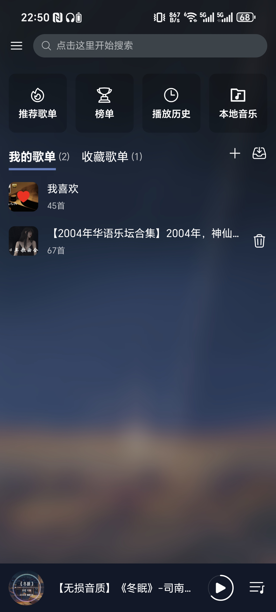

#### 侧边栏

- 侧边栏

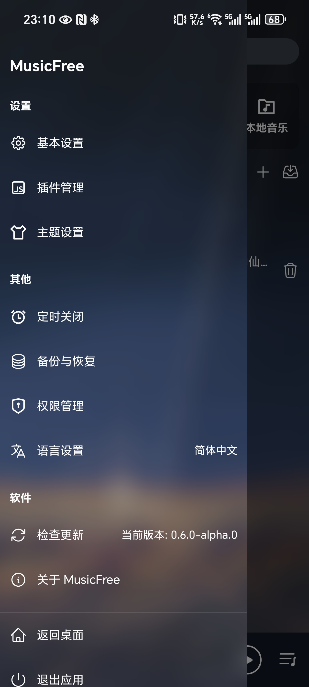

- 基础设置

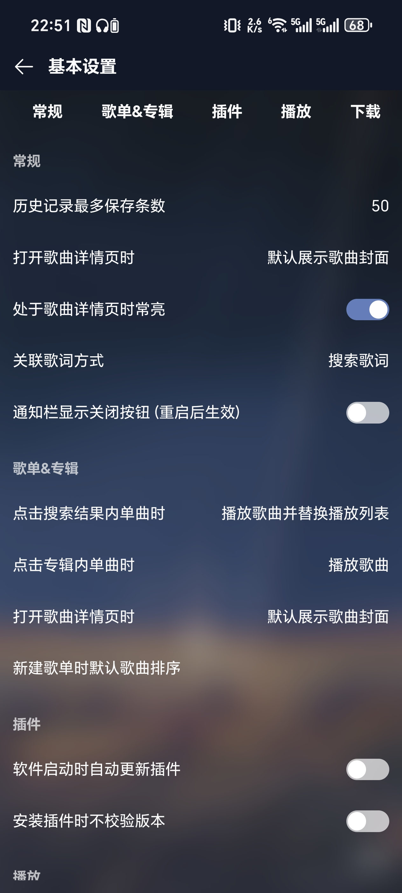

- 主题设置

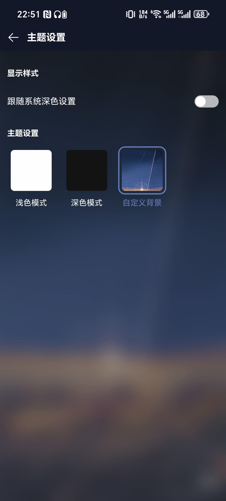

#### 音乐相关

- 歌单页

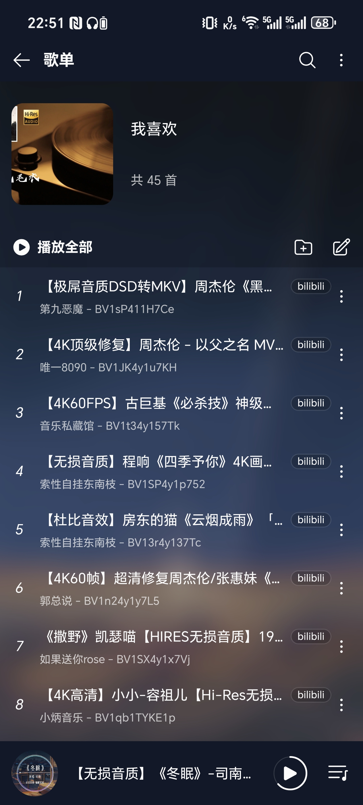

- 歌单内检索

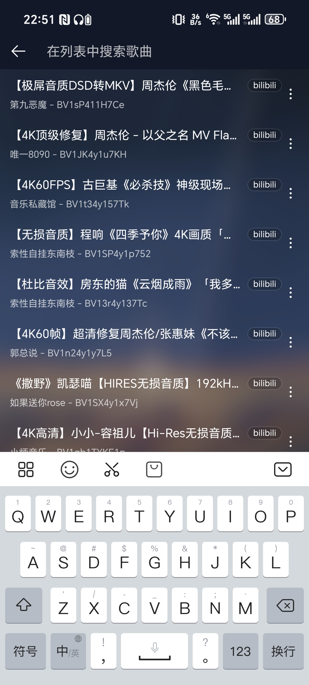

- 播放页

- 歌词页

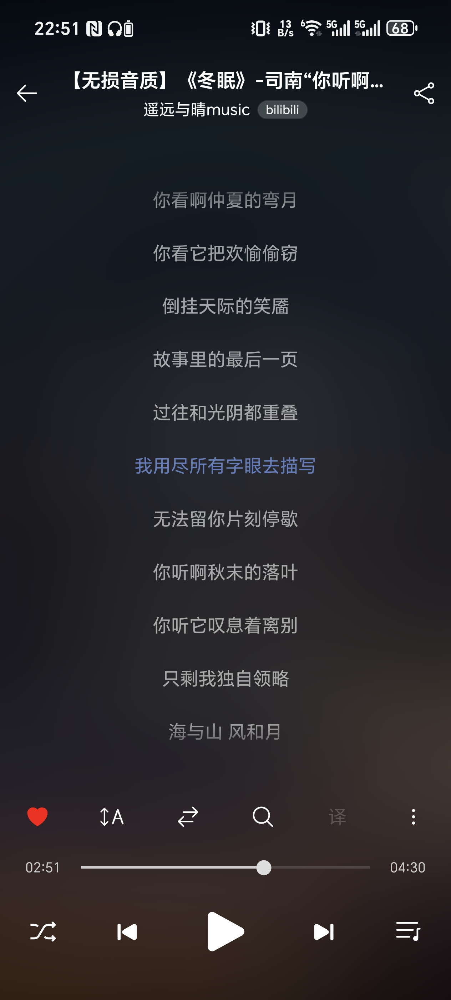

#### 搜索相关

- 作者信息

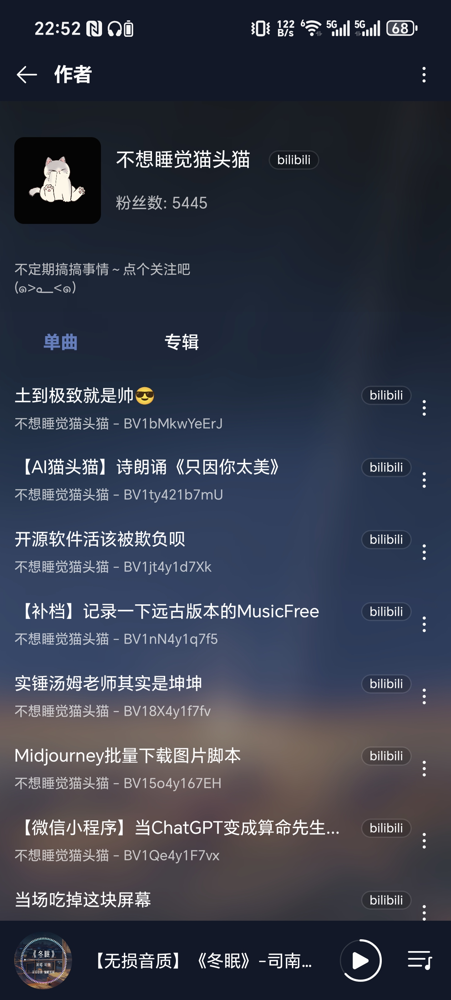

以下是软件早期版本的 UI

#### 主界面

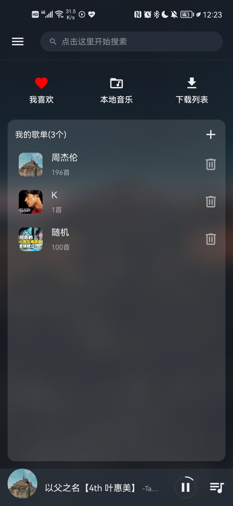

#### 侧边栏

- 基础设置

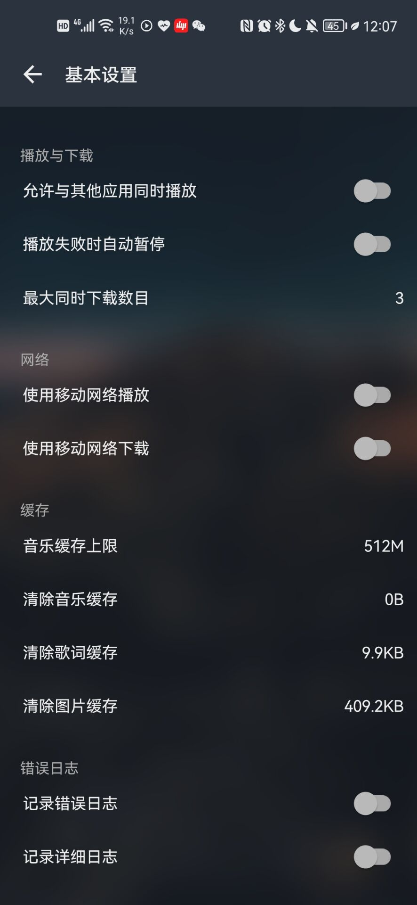

- 主题设置

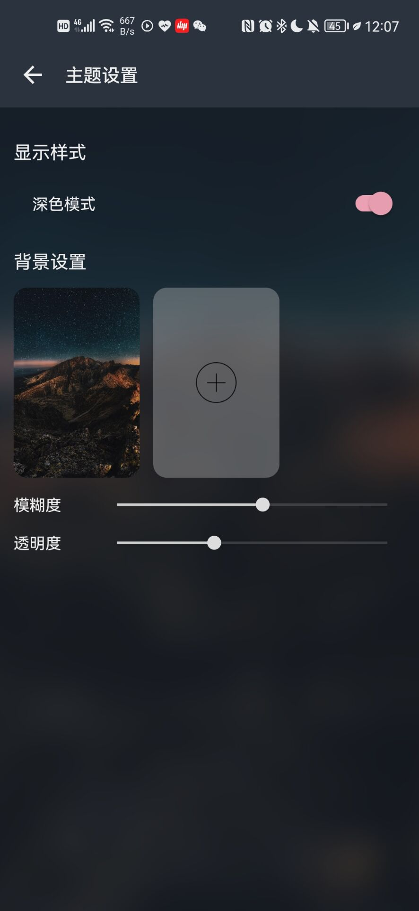

#### 音乐相关

- 歌单页

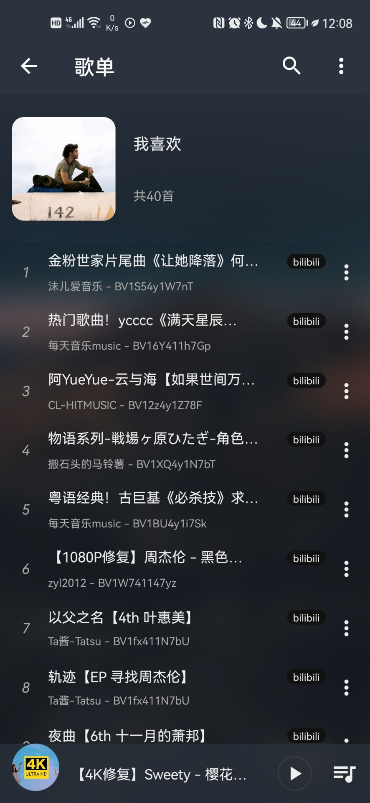

- 歌单内检索

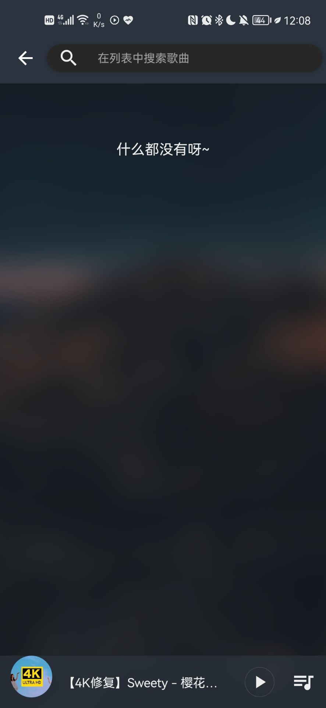

- 播放页

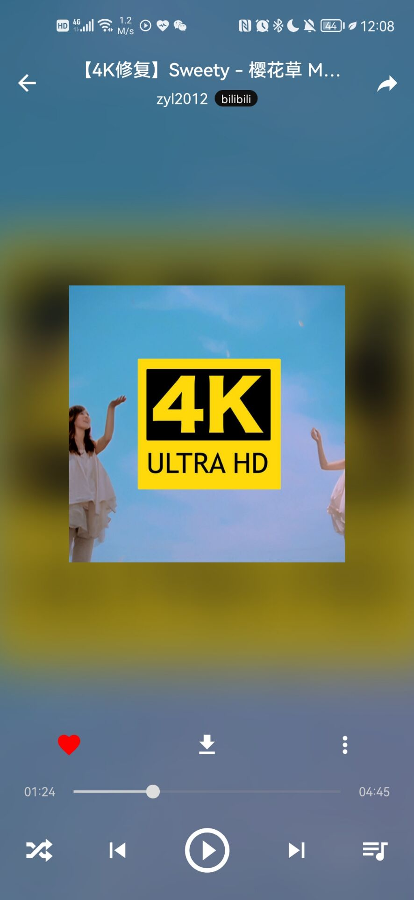

- 歌词页

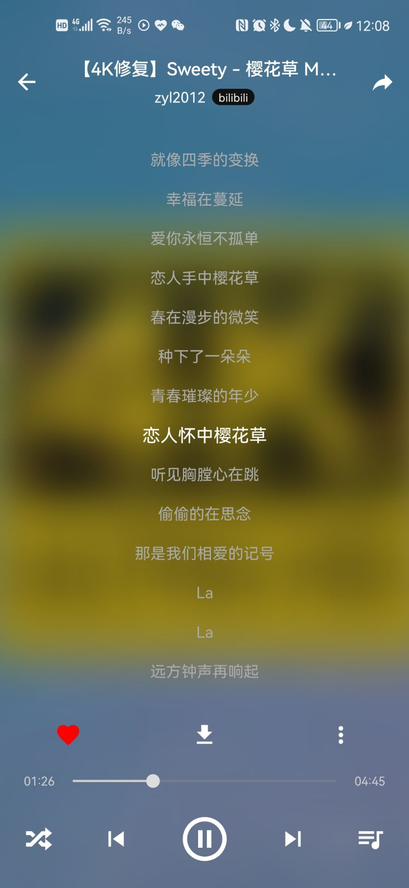

#### 搜索相关

- 作者信息

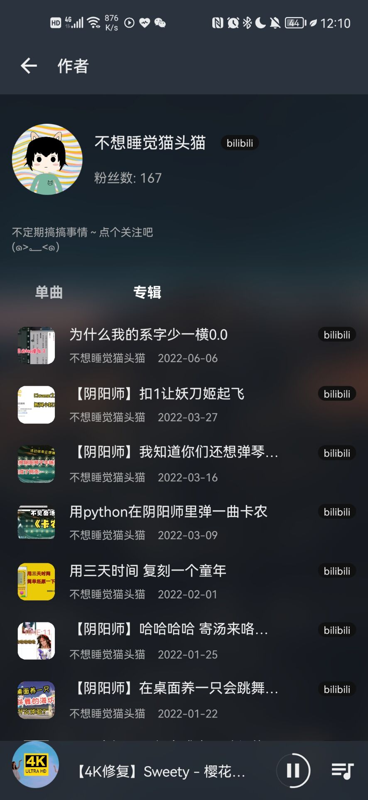

