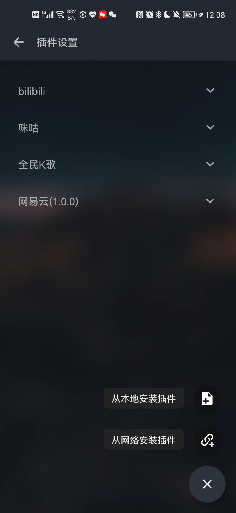
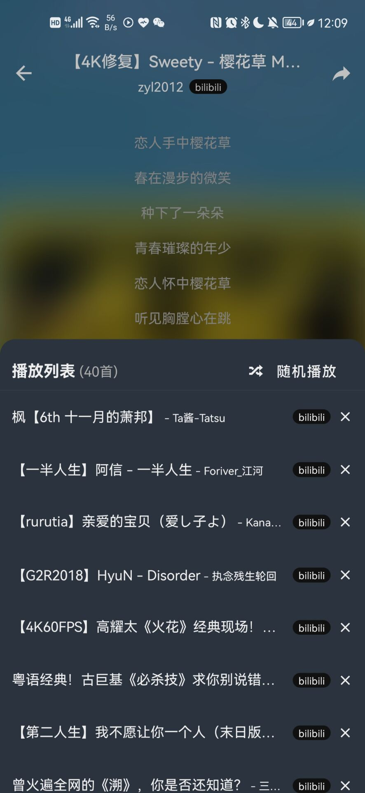

# MusicFree
---
## 简介
一个插件化、定制化、无广告的免费音乐播放器，目前只支持Android和Harmony OS。

如果需要了解后续进展可以关注b站账号：[不想睡觉猫头猫](https://space.bilibili.com/12866223)；如果有问题可以在issue区或者qq群：[252994941](https://jq.qq.com/?_wv=1027&k=igip9n4T)反馈。

介绍&使用视频可以看这里：[B站视频](https://www.bilibili.com/video/BV1qe4y1e76b/?vd_source=e8accf11e2b54f8b670ba6118bd36678#reply134846503408)

## 特性
- 插件化：本软件仅仅是一个播放器，本身**并不集成**任何平台的任何音源，所有的搜索、播放、歌单导入等功能全部基于**插件**。这也就意味着，**只要可以在互联网上搜索到的音源，只要有对应的插件，你都可以使用本软件进行搜索、播放等功能**。关于插件的详细说明请看插件一节。

- 插件支持的功能：搜索（音乐、专辑、作者）、播放、查看专辑、查看作者详细信息、导入单曲、导入歌单、获取歌词等。

- 定制化、无广告：本软件提供了浅色、深色模式；支持自定义背景；本软件基于GPL协议开源，~~一个star做交易~~ 将会保持免费。
- 隐私：所有的数据都存储在本地，本软件不会收集你的任何个人信息。
- 歌词关联：你可以把两首歌的歌词关联起来，比如将歌曲A的歌词关联到歌曲B，关联后A、B两首歌都将显示歌曲B的歌词。你也可以关联多首歌的歌词，如A->B->C，这样A、B、C三首歌都将显示C的歌词。

## 插件
### 插件简介
插件本质上是一个满足插件协议的js函数。插件中定义了搜索（音乐、专辑、作者）、播放、查看专辑、作者详细信息、导入歌单、获取歌词等基本函数，插件的开发者只需要关心输入输出逻辑，至于分页、缓存等全都交给MusicFree控制即可。本软件通过插件来完成播放器的所有功能，这样解耦的设计也可以使得本软件可以专注于做一个功能完善的播放器，我直呼小而美。

插件开发文档可以参考 [这里](http://blog.upup.fun/2022/09/15/%E5%BC%80%E5%8F%91MusicFree%E6%8F%92%E4%BB%B6/) (写的很简略....真的有人需要的时候再详细写吧..)

需要注意的是：
- 如果你是使用第三方下载的插件，那么请自行鉴别插件的安全性（基本上看下没有奇怪的网络请求什么的就好了；自己写的最安全，*不要安装来路不明的东西*），防止恶意代码破坏。因为第三方恶意插件导致的可能的损失与本软件无关。

- 插件使用过程中可能会产生某些和本软件无关的版权数据，插件产生的任何数据与本软件无关，请使用者自行删除数据。

### 插件使用
下载app之后，只需要在侧边栏设置-插件设置中安装插件即可。支持安装本地插件和从网络安装插件（支持解析.js文件和.json描述文件；已经写了几个示意的插件：[指路这个仓库](https://github.com/maotoumao/MusicFreePlugins)，不过可能功能还不是很完善）；
你可以直接点击从网络安装插件，然后输入https://gitee.com/maotoumao/MusicFreePlugins/raw/master/plugins.json ，点击确认即可安装。

## 下载地址
请转到发布页查看：[指路](https://github.com/maotoumao/MusicFree/releases) (如果打不开可以把github换成gitee)

## WIP
### 1.0版本
1. 歌曲批量编辑 [100%]
2. 最近播放 [0%]
3. 横屏适配 [0%]
4. 其他剩余功能
### 2.0版本
1. ReactNative版本升级
2. 体验优化（长列表、弹窗、底部浮层等）
3. 代码逻辑优化

## ChangeLog
`2022.10.22  v0.0.1-alpha.6`
1. 重要!! v0.0.1-alpha.5以前的版本无法通过app正常更新，请在gitee/github发布页下载最新版本(v0.0.1-alpha.6)，或QQ群自取；
2. 导入本地音乐时，如果未识别本地音乐文件，则会使用文件名作为音乐名；
3. 自建歌单、专辑详情页增加批量选择功能，可点击右上角查看(歌曲较多时可能有点卡，后续优化)；使用方式：选中歌曲可进行下一首播放/加入歌单/下载/删除，长按拖动进行排序；删除/排序后点击保存按钮方可生效
4. 调整歌单内歌曲编号字体大小；

`2022.10.16  v0.0.1-alpha.5`
1. 新增功能：导入本地音乐文件
2. 从网络源安装的插件可在插件页直接更新
3. 调整下载逻辑

`2022.10.06  v0.0.1-alpha.4`
1. 修复专辑详情页没有loading的问题
2. 为插件新增Cookie管理器
3. 优化播放页的显示
4. 新增一键卸载全部插件的功能

`2022.10.04  v0.0.1-alpha.3`
1. 修复设置页无法滚动的问题
2. 修复播放结束时可能暂停的问题

`2022.10.03  v0.0.1-alpha.2`
1. 插件协议更新，需要重新安装插件
2. 支持批量导入插件
3. 新增清空播放列表功能
4. 优化搜索结果面板和播放专辑逻辑

`2022.10.02`
测试版本出现啦！撒花

## 支持这个项目
如果你喜欢这个项目，或者希望我可以持续维护下去，你可以通过以下任何一种方式支持我;)
1. Star这个项目，分享给你身边的人；
2. 关注b站[不想睡觉猫头猫](https://space.bilibili.com/12866223)或公众号获取最新信息；

---
本项目仅供学习参考使用，使用请遵从GPL3.0协议；请在符合法律法规的情况下合理使用本项目。

## 应用截图
#### 主界面

#### 侧边栏
- 基础设置

- 插件设置

- 主题设置

#### 音乐相关
- 歌单页

- 歌单内检索

- 播放页

- 歌词页

- 播放列表页

#### 搜索相关
- 搜索单曲

- 搜索专辑

- 专辑信息

- 搜索作者

- 作者信息

